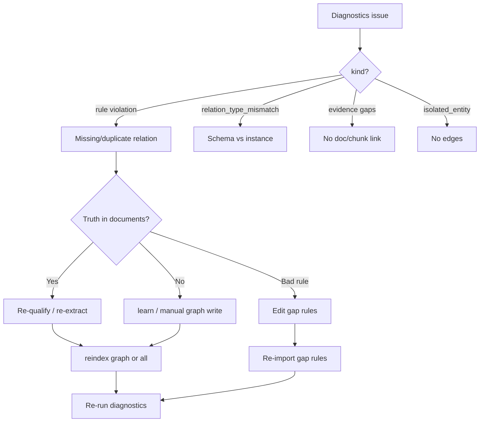

# Immeuble demo — graph gap diagnostics and remediation

This guide documents the **immeuble-demo** workspace for Studio users: what graph
gap tools reveal, and how to **remediate** issues (re-parse documents vs add
missing facts).

**Canonical copy (MindBrain repo):**
[`../../../mindbrain/docs/methodology/graphing/immeuble-gap-diagnostics-demo.md`](../../../mindbrain/docs/methodology/graphing/immeuble-gap-diagnostics-demo.md)

This file is kept in sync for Studio workflows (`pnpm load:demo`,
`pnpm studio -- --sqlite data/immeuble-demo.sqlite`, diagnostics panel
roadmap §9b).

Related in this repo:

- [demo-immo/immeuble-demo/README.md](../demo-immo/immeuble-demo/README.md)
- Gap rules (GhostCrab):
  `../../ghostcrab-personal-mcp/examples/immeuble-demo/gap-rules.demo.json`

---

## Two graphs, two semantics

| Layer | Role | Immeuble example |
|-------|------|------------------|
| **Schema / ontology graph** | What *may* exist (open world) | `unit`, `building`, `assigned_cellar` |
| **Instance / data graph** | What *is* observed | `Tilleuls Appartement A3`, `Nicolas Dupont` |

**Open world:** a missing `occupies` edge is not automatically an error.

**Closed world (syndic):** missing cellar, garage, or building link *is* an error
when declared in **`graph_gap_rules`**.

---

## Quick start (Studio)

```bash
# From mindbrain-personal-studio/
pnpm load:demo
pnpm backend               # terminal 1 — chooses a free backend port
pnpm dev                   # terminal 2 — Studio on same SQLite runtime

# Diagnostics demo script (MindBrain sibling repo)
bash ../mindbrain/scripts/demo-immeuble-gaps.sh
bash ../mindbrain/scripts/demo-immeuble-gaps.sh --simulate-anomaly
```

Equivalent explicit SQLite workflow:

```bash
pnpm backend -- --sqlite data/immeuble-demo.sqlite
pnpm dev -- --sqlite data/immeuble-demo.sqlite
```

One-terminal alternative:

```bash
pnpm studio -- --sqlite data/immeuble-demo.sqlite
```

**Database:** `data/immeuble-demo.sqlite`
**Workspace:** `immeuble-demo` · **Ontology:** `immeuble-demo::core`
**Expected scale:** ~131 entities, ~265 active relations after load + reindex.

The backend runtime is written under `data/runtime/`. Studio exposes the
resolved backend and SQLite path at `/api/brain/health`.

---

## Tools and what they discover

Analysis runs in **MindBrain**; GhostCrab MCP and Studio consume the same HTTP
JSON (`GET /api/mindbrain/graph/diagnostics`).

### Import rules — `ghostcrab_graph_gap_rules_import`

Installs closed-world checks from `gap-rules.demo.json`:

| rule_id | Check |
|---------|--------|
| `unit-one-cellar` | each unit → exactly one `assigned_cellar` |
| `unit-in-building` | each unit → ≥1 inbound `contains` |
| `garage-at-most-one-unit` | parking ← max one `assigned_garage` |

Without this step, diagnostics cannot enforce syndic invariants.

### Diagnostics — `ghostcrab_graph_diagnostics`

Unified report: **rules + native checks**.

**Golden (rules loaded, data OK):**

```text
rules_evaluated: 3
missing_required_relations: 0
cardinality_violations: 0
```

**Still visible on immeuble (normal for act 1):**

| kind | Example finding |
|------|-----------------|
| `relation_type_mismatch` | instance uses `contains`; ontology expects typed edges like `building_contains_unit` |
| `entity_without_evidence` | synthetic entities without chunk/document link |
| `relation_without_evidence` | structural edges without `ref_doc_id` |
| `isolated_entity` | e.g. Marie Lambert, degree 0 |

**After anomaly (cave removed on Tilleuls A3):**

```json
{
  "kind": "missing_required_relation",
  "rule_id": "unit-one-cellar",
  "entity_id": 18,
  "observed_count": 0
}
```

### List rules — `ghostcrab_graph_gap_rules`

Audits what is evaluated (severity, direction, min/max, enabled).

### Coverage — `ghostcrab_coverage`

Ontology **instantiation** gaps (schema not used in data) — complementary to
rule violations (data not conforming to business contract).

### Exploration (drill-down in Studio or MCP)

After an issue: `ghostcrab_graph_search`, `GET /graph/entity`, `ghostcrab_traverse`,
`ghostcrab_entity_chunks`.

Example: entity **Tilleuls Appartement A3** — Dupont household, garage, building
links; missing cellar after act 3.

---

## Remediation methodology



### When to reparse documents vs add data manually

| Situation | Prefer |
|-----------|--------|
| Fact appears in syndic PDF/Markdown but not in graph | **Reparse** — qualification + extraction on `documents/` or `sources/` |
| Phone correction, agent note, no source doc yet | **Add** — `ghostcrab_learn` or graph upsert |
| Diagnostics rule does not match domain language | **Fix contract** — edit `gap-rules.demo.json`, re-import |
| Generic `contains` vs typed ontology edges | **Pipeline/ontology** — normalise on reindex or roadmap §12 SHACL |

### Workflow

1. Read `summary` on diagnostics panel or MCP.
2. Open issue → note `entity_id` / `rule_id`.
3. Drill down in Studio graph explorer or MCP traverse/search.
4. Apply one track:
   - **Documents:** sources in [`docs/demo-immo/immeuble-demo/sources/`](../demo-immo/immeuble-demo/sources/)
     and [`documents/`](../demo-immo/immeuble-demo/documents/) — annexes, baux,
     registre, CODA, composition ménages.
   - **Manual:** learn + `reindex/graph`.
   - **Rules:** edit JSON in GhostCrab examples, re-import.
5. Re-run diagnostics until resolved or explicitly accepted.

### Document hints by scenario

| Scenario | Sources in this repo |
|----------|----------------------|
| Annexes | `sources/annexes-caves-garages-jardins.md`, `documents/annexes-jardins-garages.md` |
| Baux | `sources/baux-locatifs.md`, `documents/baux-erables.md` |
| Ménages | `sources/composition-occupants.md`, `documents/composition-menages.md` |
| CODA | `sources/coda-janvier-2026.md`, `documents/extrait-coda-janvier-2026.md` |

### Restore golden demo after act 3

```bash
pnpm load:demo
# or demo script without --simulate-anomaly
bash ../mindbrain/scripts/demo-immeuble-gaps.sh --cli-only
```

---

## Simulate anomaly (act 3)

```bash
sqlite3 data/immeuble-demo.sqlite <<'SQL'
UPDATE graph_relation SET deprecated_at = datetime('now')
WHERE relation_id = (
  SELECT r.relation_id FROM graph_relation r
  JOIN graph_entity src ON src.entity_id = r.source_id
  JOIN graph_entity tgt ON tgt.entity_id = r.target_id
  WHERE r.workspace_id = 'immeuble-demo'
    AND r.relation_type = 'assigned_cellar'
    AND r.deprecated_at IS NULL
    AND src.name = 'Tilleuls Appartement A3'
  LIMIT 1
);
SQL
```

---

## Studio roadmap §9b

Target UI: diagnostics panel with `summary` counters, filterable `issues` table,
click-through to entity/relation inspector — same JSON as curl/MCP.

See MindBrain [Roadmap.md §9b](../../../mindbrain/Roadmap.md).

---

## MCP checklist

Use the backend URL reported by `pnpm backend`, or read it from
`/api/brain/health` / `data/runtime/*.backend.json`.

```text
workspace_id: immeuble-demo
```

1. `ghostcrab_graph_gap_rules_import`
2. `ghostcrab_graph_diagnostics`
3. `ghostcrab_graph_gap_rules`
4. `ghostcrab_coverage`
5. Search / traverse for investigation
